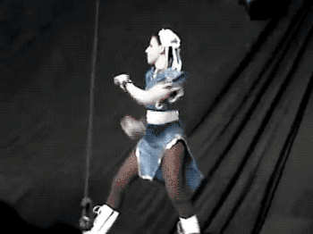
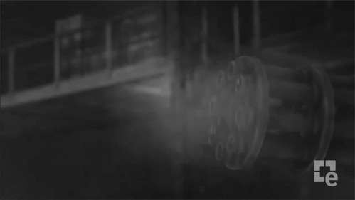

= Ceinture noire `Karate` 🥋 en tests d’API REST
:icons: font
:asset-uri-scheme: https
:source-highlighter: highlightjs
:deckjs_theme: swiss
:deckjs_transition: fade
:navigation: false
:goto: true
:status: true
:conf: devfesttoulouse

image::images/{conf}.jpg[float="right"]

== Nico et Benoit

icon:twitter[] @NicolasComet +
icon:github[] https://github.com/ncomet +
icon:twitter[] @binout +
icon:github[] https://github.com/binout

image::images/lectra.png[]

image::images/lectra-versalis.jpg[versalis, 800]

== Problématique

image::images/karate-pbk.png[]

== Solution 1 : JaxRs Client

[source, java]
----
@Test
public void should_process_order_and_then_cancel() throws Exception {
    // Create new Order
    final String orderId = IntegrationTestCase.newProductOrderId();

    // Process Order
    final Response response = IntegrationTestCase.newClient().path("/product-orders/" + orderId)
            .request()
            .put(Entity.json("{\"reference\" : \"ABTYD\"}"));
    assertThat(response.getStatusInfo()).isEqualTo(Status.OK);

    // Cancel Order
    final Response response = IntegrationTestCase.newClient().path("/product-orders/" + orderId)
            .request()
            .delete();
    assertThat(response.getStatusInfo()).isEqualTo(Status.NO_CONTENT);
}
----

[canvas-image=images/boring.png]
== Boring

[.canvas-caption, position=bottom-left]
Maintenance et écriture pénible
[.canvas-caption, position=center-left]
Verbeux
[.canvas-caption, position=top-left]
Besoin de commentaires

== Solution 2 : Rest Assured

[source, java]
----
@Test
public void lotto_resource_returns_200_with_expected_id_and_winners() {

  when().
    get("/lotto/{id}", 5).
  then().
    statusCode(200).
      body("lotto.lottoId", equalTo(5),
      "lotto.winners.winnerId", containsOnly(23, 54));
}
----

[canvas-image=images/code.png]
== Boring

[.canvas-caption, position=center-left]
Plus élégant avec un DSL en java
[.canvas-caption, position=bottom-left]
mais reste du code, et encore un peu verbeux

[canvas-image=images/karate-large.png]
== Karate Large

[.canvas-caption, position=bottom-left]
Une autre solution !

== Karate

image::images/karate-logo.svg[float="right"]

[quote, Peter Thomas (Intuit)]
Web-Services Testing Made Simple.

icon:github[] https://github.com/intuit/karate (+1000 icon:star[])

icon:twitter[] @KarateDSL

* Février 2017 : 1ère release (`0.1.2`)
* Juillet 2018 : `0.8.0`

== Hello Cats

image::https://github.com/intuit/karate/raw/master/karate-demo/src/test/resources/karate-hello-world.jpg[]

== Standalone Runner

.Testing `https://pokeapi.co/api/v2`
[source]
----
java -jar karate.jar -t pokemon.feature
----

== Tests avec Karate

DSL `Gherkin` pour écrire des tests d'APIs HTTP MAIS *ce n'est pas du BDD !*

image::images/cucumber.png[float="center"]

* ✍️ Facile à écrire et à maintenir
* 👌 Pas de _glue_  à coder
* ⏱️ Rapide à exécuter (en parallèle)
* 📄 JSON _first class citizen_

== Démo dans l'IDE

image::images/demo.gif[]

== Documentation

image::images/documentation.png[]

== Pour aller plus loin

image::images/kick-pain.gif[float="right"]

* 🤥 Mock Servlet : pas besoin de démarrer un _vrai_ serveur
* 📑 Intégration à Spring REST Docs
* 🖥️ Import scenario Postman
* 🤮 Supporte aussi SOAP (XML)
* 🔜 Utilisation dans scenario Gatling

== Gatling

Utilisation des `.feature` comme source de scénario Gatling

 

== Travaux futurs

++++

<blockquote class="twitter-tweet" data-lang="fr">
<a href="https://twitter.com/KarateDSL?ref_src=twsrc%5Etfw">@KarateDSL</a> as a UI automation framework ?   I think this may *actually* work ! <a href="https://t.co/6j47L3kLQo">pic.twitter.com/6j47L3kLQo</a>
&mdash; Peter Thomas (@ptrthomas) <a href="https://twitter.com/ptrthomas/status/1044069611082305537?ref_src=twsrc%5Etfw">24 septembre 2018</a></blockquote>

<blockquote class="twitter-tweet" data-lang="fr">
working through the &quot;Cucumber Exit&quot; for <a href="https://twitter.com/KarateDSL?ref_src=twsrc%5Etfw">@KarateDSL</a> code-named CUKEXIT :P<a href="https://t.co/fao8Fn5qRM">https://t.co/fao8Fn5qRM</a>
&mdash; Peter Thomas (@ptrthomas) <a href="https://twitter.com/ptrthomas/status/1023612849418108929?ref_src=twsrc%5Etfw">29 juillet 2018</a></blockquote>

++++

== Questions ?

image::images/salute.gif[salute, 640]

Le code et les slides : icon:github[]/ncomet/karate-conf2018

